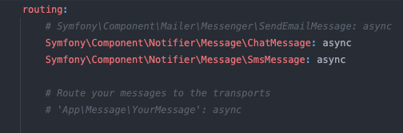

Sortie.com    
---
Groupe 2 Harold, Thomas, Max 

## Stack
- PHP 8.1+
- Symfony 6.4.8 LTS | Twig
- Bootstrap 5.3
- MySQL
- Un peu de JS

### Bundles utilisés
composer install

- apache-webpack -> réseau
- fakerphp pour les fixtures
- voters

### Mailer DSN
Pour tester les envois de mails :
https://mailtrap.io/
Gratuit, simple, efficace. 
Il faut se créer un compte, et copier/coller dans le .env la ligne MAILER_DSN prévue pour Symfony 5+
Aussi pour éviter que les mails partent dans la table messenger_, dans config/messenger.yaml,
commenter la première ligne sous 'routing'
- 

## Bon à savoir :

### Fixtures
Si des fixtures sont chargées, les dates peuvent être incohérentes mais les fonctionnalités de l'app restent fonctionnelles
### Services
La majorité des méthodes ont été déportées des controllers vers les services correspondant dans un souci de clarté et maintenabilité
### Utilisateurs
Un utilisateur qui s'inscrit obtient un statut 'actif' automatiquement. Il a la possibilité de se désinscrire, mais seul un admin peut désactiver un utilisateur.
Un user peut :
- S'il est anonyme, s'inscrire, se logguer, et voir les sorties sur la page d'accueil sans trop de détails
- Créer une sortie, et la modifier à volonté tant que les inscriptions sont ouvertes
- S'il veut la supprimer :
    - Il peut, sans motif tant que la sortie n'est pas publiée (statut Ouverte)
    - Il peut, en indiquant un motif de suppression, si la sortie a été publiée. Auquel cas, elle n'est pas supprimée mais passe en statut "Annulée"
    - Il ne peut plus une fois les inscriptions closes
- Créer un groupe privé (feature en cours de dev)
- S'inscrire ou se désister d'une sortie si les inscriptions sont ouvertes.
- Se désinscrire de la plateforme
- Modifier son profil, changer son mot de passe (y compris s'il l'a oublié)
### Admin
Si un admin désactive un user, via le panneau de commande dédié, celui-ci restera bloqué à l'écran login et ne pourra même plus se connecter
- Un admin a les mêmes privilèges qu'un User
- Peut aussi supprimer à la volée des users et des sorties tant qu'elles ne sont pas démarrées.

### Inactif
- A été mis en place un système de vérification du user par le biais d'un token (sans bundle) et échange de mail,
puis ce service a été désactivé car l'admin a la possibilité d'activer/désactiver directment un user
- Dans certains cas, l'envoi de mail est fonctionnel mais désactivé car trop d'envois de mails potentiels pour le service gratuit qu'est mailtrap
